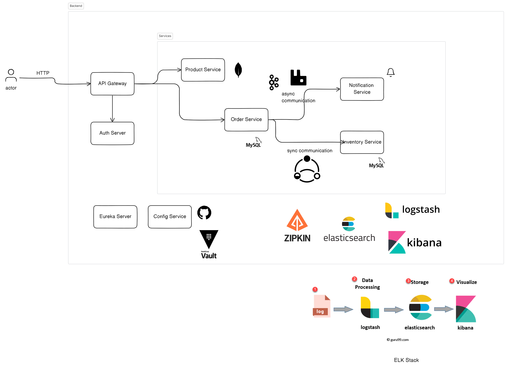

# Demo Microservices

Microservices using Spring Boot.

It will have services like:
- Product Service: create, view products
- Order Service: create order
- Inventory Service: check products stock
- Notification Service: send notifications (using Kafka)
There will be **synchronous** and **asynchronous** communication.

### Eureka Server
> Máy chủ đăng kí dịch vụ trong hệ thống Microservices.

- Đảm nhiệm việc đặt tên cho mỗi microservice.
---

**_Vì sao cần phải đặt tên??_**

👉 Khi nhiều microservices được triển khai và hoạt động trên nhiều instance khác nhau, không cần phải mã hóa địa chỉ IP cứng của mỗi service. Thay vào đó, tìm kiếm tên service đã được đăng kí trên Eureka Server sẽ thuận tiện hơn.

=> Quản lý và mở rộng dịch vụ dễ dàng và hiệu quả hơn.

---

- Mỗi service đăng ký với Eureka sẽ cần gửi ping request tới Eureka Server để thông báo rằng service đó vẫn đang hoạt động
    - Nếu Eureka Server không nhận được thông báo từ một dịch vụ nào đó, dịch vụ đó sẽ bị hủy đăng ký một cách tự động trong Eureka Server

- Discorvery Server sẽ lưu trữ danh sách địa chỉ đăng kí của một service.
    - Khi một service muốn tìm kiếm địa chỉ của service khác, sẽ check trong danh sách các local copies của địa chỉ đăng kí của service đó.
    - Trong trường hợp các local copies không hợp lệ, Discovery Server sẽ trả về thông báo rằng service cần tìm không available.

## Inter Service Communications
- Using WebClient

